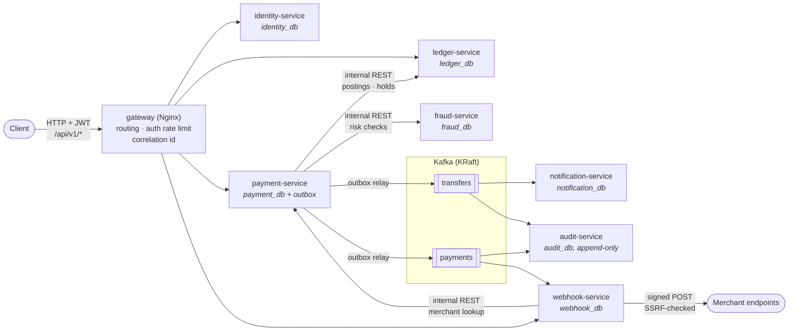
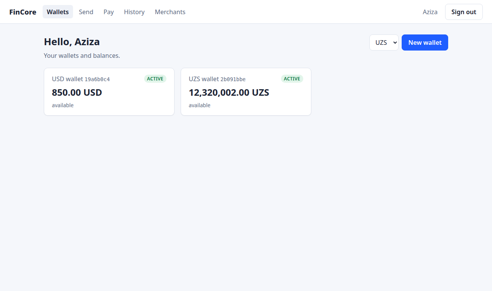
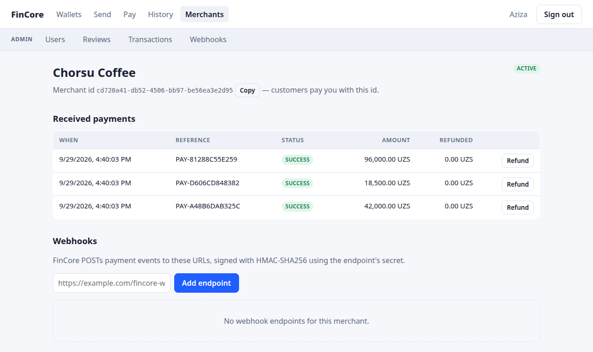
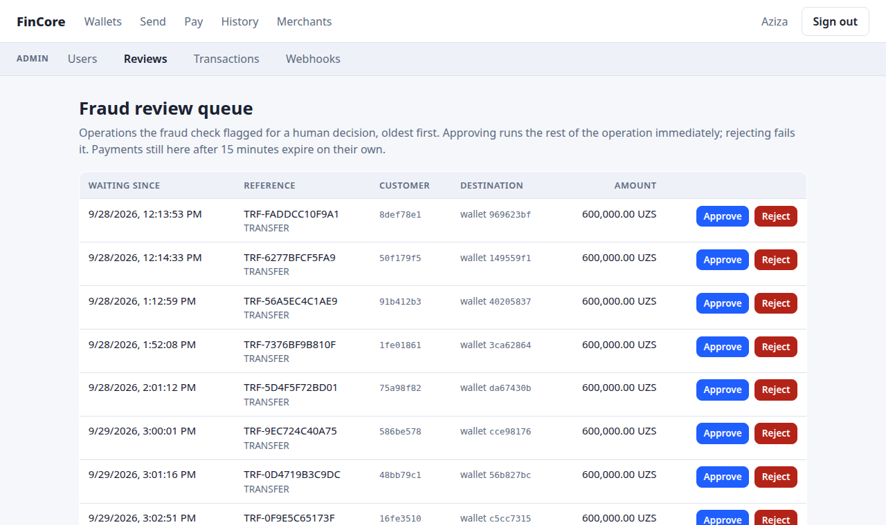
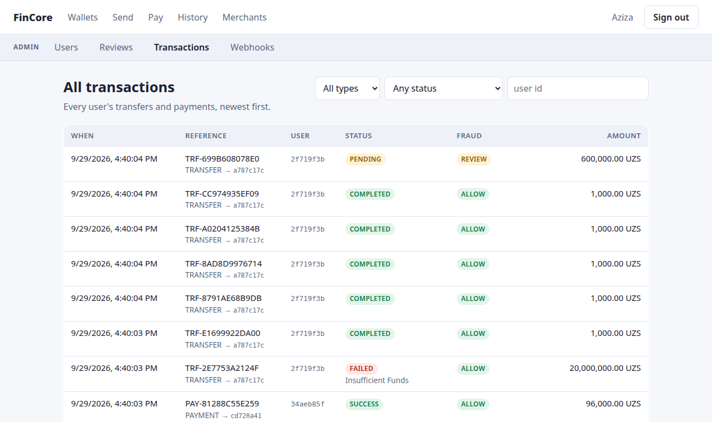

# FinCore

**▶ Customer app: [ninth-distinct-sincere.ngrok-free.dev](https://ninth-distinct-sincere.ngrok-free.dev)** ·
**Admin console: [ninth-distinct-sincere.ngrok-free.dev/admin](https://ninth-distinct-sincere.ngrok-free.dev/admin)**
(staff accounts only)

The public link opens on any phone or computer. It's served from the
author's machine through an ngrok tunnel, so it's up while that machine
is on. ngrok's free tier shows a one-time "Visit Site" notice to each new
visitor. Locally the same apps are at
[http://localhost:8180](http://localhost:8180) and
[/admin](http://localhost:8180/admin). Start the stack once with
`docker compose up -d --build --wait` (see [Run it](#run-it)); every
container has `restart: unless-stopped`, so it comes back by itself
after a crash or a reboot. To give your own copy a public link, see
[Public link](#public-link-optional).

A digital wallet and payment platform built as a microservices system, in
the style of a real core-banking backend: database-per-service,
double-entry ledger, sagas for distributed consistency, transactional
outbox, and asymmetric-JWT auth with JWKS.

This is a learning-driven, production-oriented portfolio project — not a
tutorial. Every non-obvious decision is recorded as an [ADR](docs/adr/)
rather than left implicit, and the full design rationale lives in
[`docs/spec.md`](docs/spec.md).

**Status: Phases 0–7 complete.** All seven services — identity,
ledger, payment, fraud, notification, webhook and audit — are built,
tested and run together via Docker Compose with the gateway, Kafka,
Jaeger, Prometheus and Grafana, plus a React + TypeScript web app (user
dashboard and support/admin panel) served through the same gateway.
Every package has unit and integration tests against real
PostgreSQL/Kafka, every API and event is covered by a committed
contract, a 46-test end-to-end suite runs against the live stack in CI,
and a load test gates on ledger reconciliation. Integrations designed but not yet built are listed
in [`docs/context-map.md`](docs/context-map.md); the table in
[Roadmap](#roadmap) tracks status precisely — nothing here is described
as done unless it's tested and running.

---

## Architecture



Arrows between services are synchronous internal calls; everything
through Kafka is asynchronous, published through payment-service's
transactional outbox. Each service owns one PostgreSQL database (shown in
its node). More diagrams, all drawn from the implementation:
[architecture and runtime topology](docs/diagrams/architecture.md),
[transfer saga](docs/diagrams/transfer-saga.md),
[payment and refund sagas](docs/diagrams/payment-saga.md),
[event flow](docs/diagrams/event-flow.md).

Bold rule underlying every service boundary: **a service owns its API,
its logic, and its data — no cross-service database access, no shared
domain models.** Data that must change atomically (a wallet balance and
its ledger entries) stays inside one service rather than being split
across a distributed transaction. The full reasoning is in
[`docs/context-map.md`](docs/context-map.md) and Section 3 of the spec.

### Why services are split this way

| Service | Owns | Why it's separate |
|---|---|---|
| `identity-service` ✅ | users, roles, sessions, refresh tokens | Different security/scaling profile from money movement |
| `ledger-service` ✅ | ledger accounts, postings, entries, balances, holds | Core banking; accepts balanced postings only, knows nothing about *why* — this is what keeps it the most stable service in the system |
| `payment-service` ✅ | transfers, payments, refunds, idempotency keys, the outbox | Owns the saga; transfers/payments/refunds share the same orchestration machinery, so splitting them would duplicate it |
| `notification-service` ✅ | notifications, retry/DLT state | Pure asynchronous event consumer — the natural boundary for "reacts, doesn't decide" |
| `fraud-service` ✅ | fraud checks, rules | Isolated so the rule engine can become an ML model later without touching payment logic |
| `webhook-service` ✅ | webhook endpoints, deliveries, attempts | Same "reacts, doesn't decide" boundary as `notification-service`, plus its own public registration API — a merchant-facing surface `payment-service` shouldn't own |
| `audit-service` ✅ | audit logs, dead-letter state | Same "reacts, doesn't decide" boundary as `notification-service`, plus append-only storage enforced at the database-role level — a property no other service's data needs |

✅ = implemented. Everything else is designed (ADRs + context map) and
scheduled per the [roadmap](#roadmap).

---

## Tech stack

```text
Python 3.12, FastAPI, Pydantic v2, SQLAlchemy 2.x (async), Alembic
PostgreSQL (one database, one least-privilege role, per service)
Kafka (KRaft mode — no Zookeeper), aiokafka
OpenTelemetry (traces) + Jaeger, Prometheus + Grafana (metrics), structured JSON logging
Nginx (gateway), Docker / Docker Compose
pytest + pytest-asyncio + testcontainers (real PostgreSQL/Kafka in tests, never SQLite or fakes)
JSON Schema + committed OpenAPI contracts, Locust (load testing)
ruff + mypy
GitHub Actions
```

Planned, not yet introduced (added when the roadmap reaches them, per the
project's own rule against speculative infrastructure): Redis.

---

## What's implemented

### `identity-service`

Authentication, users, and RBAC — spec Sections 5 and 19.

* `POST /api/v1/auth/register` — email/phone uniqueness enforced at both
  the service layer (fast, friendly error) and the database's UNIQUE
  constraint (the actual race-safe guard — see
  [ADR-0002](docs/adr/0002-ledger-model.md)'s "let the database decide"
  pattern, applied here to registration).
* `POST /api/v1/auth/login` — Argon2id password verification, issues an
  access token + refresh token.
* `POST /api/v1/auth/refresh` — refresh token rotation. Redeeming a token
  is an atomic `UPDATE ... WHERE used_at IS NULL`, so two concurrent
  redemptions of the same token can't both succeed silently. Reusing an
  already-rotated token — replay or a lost race — revokes the entire
  session family.
* `POST /api/v1/auth/logout` — idempotent.
* Browser mode ([ADR-0006](docs/adr/0006-browser-auth-storage.md)): with
  `X-Refresh-Token-Transport: cookie`, login/refresh return the refresh
  token as an `HttpOnly; Secure; SameSite=Strict; Path=/api/v1/auth`
  cookie instead of in the body, and refresh/logout read it from there.
  Without the header the cookie is ignored (CSRF defence in depth).
* `GET /api/v1/users/me` — the caller's profile and roles.
* `POST /api/v1/users/me/password` — requires the current password;
  revokes every other session in the same transaction (the calling
  device stays signed in) and writes `user.password_changed` (spec
  Section 18's PASSWORD_CHANGED). A wrong current password is a `422`,
  not a `401`, so a browser client doesn't read it as a lost session.
  Rate-limited at the gateway like login.
* `GET /api/v1/users/me/sessions`, `DELETE /api/v1/users/me/sessions/{id}`
  — the caller's active sessions (user agent, IP, last use, which one is
  the current device via the access token's `sid` claim) and revoking
  one; another user's session is a `404`.
* `GET /api/v1/admin/users[/{id}]` (SUPPORT, ADMIN) — search by email,
  phone or id. `POST /api/v1/admin/users/{id}/status` (ADMIN only) —
  `BLOCKED`/`SUSPENDED` revokes every session of that user in the same
  transaction, and refresh rejects tokens whose owner isn't `ACTIVE`; an
  admin can't change their own status. Roles are re-read from the
  database on every request here, never trusted from the token.
* `python -m app.cli grant-role|revoke-role <email> <ROLE>` — the only
  way a role is ever granted; there is no HTTP endpoint for it, so the
  first `ADMIN` needs shell access to the running system.
* **Account events → audit trail** (spec Sections 14.3 and 18):
  registration, every successful login (`user.login`, with the session,
  IP and user agent — spec Section 18's USER_LOGIN "from where"), every
  status change (`user.blocked`, `user.suspended`,
  `user.reactivated`, with the acting admin and the previous status) and
  every CLI role change (`user.role_granted`/`user.role_revoked`) are
  written to identity-service's own transactional outbox in the same
  transaction as the change, then relayed to the `users` topic, which
  audit-service consumes. Ids and statuses only — no email, phone or
  name ever goes on the wire. The Kafka producer is started inside the
  relay loop with retries rather than at boot, so identity-service keeps
  serving login, refresh and JWKS while Kafka is down; events wait in
  the outbox and catch up once it's back (verified against the live
  stack).
* `GET /.well-known/jwks.json` — publishes the Ed25519 public key so any
  service can verify a FinCore JWT locally, without calling back into
  identity-service per request.
* `GET /health`, `GET /ready` — liveness and DB-readiness checks.

Passwords: Argon2id. Refresh tokens: stored only as a SHA-256 hash
(a fast hash is deliberate — the token is 256 bits of randomness, not a
low-entropy password; see the comment in `app/domain/session.py`). JWTs:
Ed25519 (EdDSA), asymmetric, short-lived (15 min default).

**Database:**

```text
identity_db: users, roles, user_roles, sessions, refresh_tokens, outbox_events
```

`roles` is seeded with `USER` / `SUPPORT` / `ADMIN` by its own migration.

### `ledger-service`

Wallets, double-entry postings, balances, and holds — the source of truth
for money (ADR-0002, spec Section 8).

* `POST /api/v1/wallets`, `GET /api/v1/wallets`, `GET /api/v1/wallets/{id}`,
  `GET /api/v1/wallets/{id}/entries` — protected by a bearer token that
  `ledger-service` verifies **entirely on its own**, using
  identity-service's JWKS endpoint (cached in memory, not fetched per
  request). No network call to identity-service on the hot path.
* `POST /internal/v1/postings` — the endpoint `payment-service` calls to
  move money; its recovery worker resolves a timed-out call by re-sending
  the same idempotent request. `GET /internal/v1/postings/{source_id}`
  looks a posting up for operators. Never routed through the gateway;
  requires the shared `X-Internal-Token` header (Section 19 — mTLS is a
  later concern).
* `POST /internal/v1/holds`, `.../{id}/capture`, `.../{id}/release` — the
  reserve → capture/release flow `payment-service`'s Payment saga calls
  (spec Section 11) — built in Phase 2, its first real caller in Phase 5.
* `GET /internal/v1/accounts/system` — looks up a pooled system
  account's id by kind and currency (e.g. `MERCHANT_SETTLEMENT`), for
  `payment-service`'s refund flow to build a posting directly, the same
  lookup `capture_hold` already does internally.
* `GET /internal/v1/reconciliation` — triggers one reconciliation pass on
  demand, on top of the background job described below.

Every posting (transfer, deposit, payment capture — anything that moves
money) goes through one function, `create_posting()`, which:

1. Checks idempotency first — `(source_service, source_id, type)` is
   unique, so a retry returns the existing posting untouched.
2. Validates `debits == credits` before taking any lock.
3. Locks every account's balance with `SELECT ... FOR UPDATE`, **one at a
   time, in ascending account_id order** — not one multi-row query,
   because PostgreSQL doesn't guarantee a single query's row-locking
   order follows `ORDER BY`. This is what lets two transfers between the
   same two wallets, in opposite directions, run concurrently without
   deadlocking each other (verified by an actual `asyncio.gather` test,
   not just reasoned about).
4. Only *after* the lock: checks currency, `ACTIVE` status, and — for
   `USER_WALLET` accounts — that available balance won't go negative.
   This ordering is the TOCTOU fix from the spec's own revision notes.
5. Inserts the posting + entries (both append-only) and applies the
   balance deltas, in one commit.

A background **reconciliation job** (spec Section 8.4, ADR-0002) runs
every `RECONCILIATION_INTERVAL_SECONDS` (default 300s) and independently
re-derives every invariant the ledger promises — straight from the
append-only entry log, never trusting the denormalized
`account_balances` cache it exists to check: every posting balanced,
each account's balance equal to the signed sum of its entries, no
wallet's available balance negative, no duplicate posting per
`source_id`. A violation is logged as an incident and never
auto-corrected — reconciliation detects, it doesn't fix.

**Database:**

```text
ledger_db: ledger_accounts, postings, ledger_entries, account_balances, holds
```

`ledger_accounts` is seeded with one system account per
`(kind, currency)` — `EXTERNAL_FUNDING`, `EXTERNAL_PAYOUT`,
`MERCHANT_SETTLEMENT`, `FEES`, `SUSPENSE` × `UZS`/`USD` — by its own
migration, alongside `account_balances` rows so every account has a
balance from the moment it exists. Two partial unique indexes (not one
plain `UNIQUE`) enforce "one wallet per user per currency" and "one
system account per kind per currency" simultaneously — a single
constraint can't do both, because SQL treats every `NULL` `owner_user_id`
as distinct.

### `payment-service`

Transfers, payments, refunds, merchants, idempotency, and the
distributed transaction — spec Sections 9, 10, 11, and 20.

* `POST /api/v1/transfers` — the flow runs in this exact order:
  authorize (does the source wallet belong to the caller — relayed to
  `ledger-service`'s own public wallet endpoint rather than duplicating
  that check) → validate (same-wallet, currency match, amount) →
  idempotency check → create the `Transfer` and run its saga.
* `GET /api/v1/transfers/{id}` — owner-only; "doesn't exist" and "exists
  but isn't yours" return the same `404`.
* `POST /api/v1/merchants`, `GET /api/v1/merchants[/{id}]` — minimal by
  design: the spec defines the `merchants` table but no onboarding flow
  beyond it, and every payment settles into one pooled
  `MERCHANT_SETTLEMENT` ledger account per currency regardless of which
  merchant it's for (ADR-0002) — a merchant row exists so a payment has
  something concrete to reference, not because the ledger needs it.
* `POST /api/v1/payments`, `GET /api/v1/payments/{id}`,
  `POST /api/v1/payments/{id}/refunds` (merchant-initiated, same
  anti-enumeration `404` as everywhere else) — see **Payments** below.
* `GET /api/v1/merchants/{id}/payments` — the payments a merchant
  received, for its owner only: how the owner finds the payment id a
  refund needs, since only the payer can read `GET /api/v1/payments/{id}`.
* **Fraud review queue** (ADR-0005's admin panel):
  `GET /api/v1/admin/reviews` (SUPPORT, ADMIN) lists transfers still
  `PENDING` and payments still `CREATED` after a `REVIEW` decision,
  oldest first. `POST /api/v1/admin/reviews/{id}` with `APPROVE` or
  `REJECT` (ADMIN only) resolves one: approve continues the saga to the
  ledger step an `ALLOW` would have run, reject fails it with the usual
  `*.failed` outbox event. The claim is one `UPDATE ... WHERE status =
  :expected AND fraud_decision = 'REVIEW' AND reviewed_at IS NULL`, so a
  second reviewer — or the payment expiration worker — loses cleanly
  with `409`; `reviewed_by_user_id`/`reviewed_at` record who decided.
* `GET /api/v1/admin/transactions` (SUPPORT, ADMIN) — every user's
  transfers and payments, filterable by type, status and user.
  Roles come from the access token's `roles` claim.
* `GET /api/v1/transactions`, `GET /api/v1/transactions/{id}` — a
  type-erased view merging Transfer *and* Payment into one newest-first
  list, exactly as `TransactionResponse.from_payment` was scaffolded to
  do back when only Transfer existed.
* `GET /internal/v1/merchants/{id}` — a merchant's owner and status, for
  webhook-service to verify ownership when an endpoint is registered.
  Internal only, `X-Internal-Token` authenticated.

**The saga** (`app/services/transfers.py`), per spec Section 10.1:

```text
fraud BLOCK               → FAILED, ledger never called
fraud REVIEW               → stays PENDING
fraud service unreachable  → fail-open/fail-closed policy decides
                              (amount ≤ threshold → ALLOW+flagged,
                               amount > threshold → REVIEW)
ledger posting succeeds     → COMPLETED
ledger business rejection   → FAILED (e.g. insufficient funds)
ledger unreachable/timeout  → stays PROCESSING — an unknown outcome is
                               never reported as a failure, because the
                               money may or may not have actually moved
```

Every status transition is an atomic `UPDATE ... WHERE status =
:expected` (`TransferRepository.transition_status`) — the state machine
is enforced by the database update itself, never assumed from
in-memory state.

**Public API idempotency** (`Idempotency-Key` header, spec Section 9.1):
a SHA-256 fingerprint of method + path + canonicalized JSON body is
stored alongside the key, so retrying the *same* request replays the
original response verbatim, while reusing the key for a *different*
request is rejected with `422`. The `UNIQUE(user_id, key)` constraint —
not the pre-check — is what actually decides a race between two
concurrent first-time requests carrying the same key.

**The recovery worker** (`app/services/recovery.py`) runs in the
background every `RECOVERY_WORKER_INTERVAL_SECONDS` (default 30s) and
retries whichever ledger call hasn't confirmed yet for any transfer,
payment, or refund stuck `PROCESSING`/`PENDING` for more than
`RECOVERY_WORKER_STUCK_AFTER_SECONDS` (default 60s). Retrying is safe:
every ledger call it retries — postings, holds, captures — is
idempotent on `(source_service, source_id[, type])`, so a retry of a
call that already succeeded just returns the existing result instead of
moving money twice.

**The transactional outbox** (`app/domain/outbox.py`, spec Section
14.1): every time a saga transitions a transfer or payment to a terminal
(or refund-affecting) status, an `outbox_events` row is written in the
*same* database transaction as that status change — so a committed
transition can never silently fail to get an event. A background relay
(`app/services/outbox.py`) wakes every `OUTBOX_RELAY_INTERVAL_SECONDS`
(default 5s) and drains the outbox batch after batch until caught up —
one topic per aggregate type (`transfers` for Transfer, `payments` for
Payment — the row's own `aggregate_type` column decides), keyed by the
operation's id for per-operation ordering. Each batch is sent as one unit
and marked published in one UPDATE, only *after* every message in it is
acknowledged; a failed send leaves the whole batch for the next pass. A
race the outbox design doesn't prevent on its own —
the recovery worker retrying an operation the original saga call is
still mid-flight on — is closed by only letting whichever caller's
`transition_status()` UPDATE actually applied write the outbox event
(verified with a real `asyncio.gather` race against Postgres, not just
reasoned about).

**Payments** (`app/services/payments.py`, spec Section 11) reuse
`ledger-service`'s hold reserve → capture API — built in Phase 2, unused
by any caller until now — instead of posting directly the way transfers
do:

```text
fraud BLOCK                    → FAILED
fraud REVIEW                    → stays CREATED
hold created + captured          → SUCCESS (auto-captured within the
                                    same saga run — no API exists yet
                                    to trigger a capture independently
                                    of creating the payment)
hold/capture business-rejected   → FAILED
hold/capture outcome unknown     → stays PROCESSING; the recovery
                                    worker resumes from whichever step
                                    didn't confirm, skipping a hold
                                    that's already on record
capture rejected after a
  successful hold                → FAILED, the hold released best-effort
```

A separate **expiration worker** (`app/services/expiration.py`) expires
payments stuck `CREATED` past a review window (`PAYMENT_REVIEW_TTL_SECONDS`,
default 900s) — most likely an unresolved fraud `REVIEW`. This is
deliberately not the recovery worker's job: the spec's own state machine
only allows `EXPIRED` from `CREATED`, never from `PROCESSING`.

**Refunds** (spec: "as new postings, never by editing old ones; total
refunds ≤ captured amount") get a minimal `PENDING`/`COMPLETED`/`FAILED`
state of their own — not the full saga treatment, but needed for the
same underlying reason: a refund's ledger posting is only reachable
over the network, so a retried refund request needs a stable id to stay
idempotent rather than risk a duplicate posting. The amount invariant is
enforced twice — an eligibility check before the idempotency key is
created, and the real, race-safe guard,
`payments.ck_payments_refunded_amount_within_bounds` (this project's
usual "let the database decide" pattern). Building a refund posting
needed one new thing from `ledger-service`: `GET
/internal/v1/accounts/system` looks up a pooled system account's id
(e.g. `MERCHANT_SETTLEMENT` for a currency) the same way `capture_hold`
already does internally — the one piece of information payment-service
was missing to construct the posting itself via the existing generic
`create_posting`.

**Database:**

```text
payment_db: idempotency_keys, transfers, payments, refunds, merchants, outbox_events
```

### `notification-service`

Consumes domain events and dispatches (mocked) notifications — spec
Sections 15 and 16. A pure event consumer: no public API beyond
`/health` and `/ready`, not routed through the gateway.

* Consumes `transfer.completed` / `transfer.failed` from the `transfers`
  topic and dispatches each through three logging-mock channels
  (`app/services/providers.py` — Email/SMS/Push behind one interface, so
  a real provider can replace a mock later without touching the
  consumer). No paid external provider is required for v1, per spec.
* **Consumer idempotency**: `notifications.event_id` is `UNIQUE` and
  doubles as the guard — a redelivered event (the normal consequence of
  Kafka's at-least-once delivery) is a no-op, not a second notification.
* **Retry topics + dead-letter queue** (`app/services/dispatch.py`, spec
  Section 16): a failed event is classified, not just retried in place —
  blocking the original partition until one poison message succeeds
  would stall every other message queued behind it.

  ```text
  permanent error (bad data)                -> DLT immediately
  transient error (e.g. provider timeout),
    attempts remaining                       -> "transfers-retry" topic, delayed
  transient error, attempts exhausted        -> DLT
  ```

  Retry state (attempt count, not-before time, last error) rides inside
  a second `EventEnvelope` on its own topic rather than a new wire
  format. Exponential backoff with jitter
  (`RetryPolicy.delay_seconds`) avoids a burst of simultaneously-failing
  messages retrying in lockstep. A dedicated retry-topic consumer (its
  own consumer group) waits out each message's remaining backoff and
  re-attempts it — delaying only that topic's own partition, never the
  main one.
* Dead-lettered events land on a `transfers-dlt` topic and in a
  queryable `dead_letters` table, with a manual-replay internal API
  (`GET`/`POST /internal/v1/dead-letters[/{id}/replay]`,
  token-authenticated like every other `/internal/*` endpoint) that
  republishes the original event onto the main topic for ordinary
  reprocessing.

**Database:**

```text
notification_db: notifications, dead_letters
```

### `fraud-service`

A rule-based risk engine (spec Section 12) — `payment-service`'s
sagas call it synchronously on every transfer and payment, and its
fail-open/fail-closed policy (`app/services/fraud.py` in
`payment-service`) was designed and tested against this service being
genuinely unreachable *before* it existed; that failure path is now
exercised by the real thing instead of only a fake transport.

* `POST /internal/v1/risk-checks` — scores an operation, persists the
  result, and returns a decision. Idempotent on
  `(operation_id, operation_type)`: a retried check for the same
  operation returns the stored result instead of re-scoring, which also
  keeps the frequency-based rules below from double-counting a retry as
  a second operation.
* Three rules (`app/services/rules.py`, spec Section 12's Strategy
  pattern — each rule is independent and contributes a fixed weight if
  triggered):

  ```text
  LARGE_AMOUNT       amount > threshold                          +30
  HIGH_FREQUENCY     ≥ N risk checks for this user in the window  +25
  REPEATED_FAILURES  ≥ N REVIEW/BLOCK decisions for this user     +25

  score 0-39  -> ALLOW
  score 40-69 -> REVIEW
  score 70+   -> BLOCK
  ```

  Two of spec Section 12's example rules — "new device" and "suspicious
  IP" — are deliberately not implemented: nothing in FinCore captures a
  device fingerprint anywhere, and `payment-service`'s risk-check
  request doesn't carry the caller's IP. Faking those signals from data
  that doesn't exist would be worse than not having them; the `Rule`
  interface is exactly what lets them be added later as real rules once
  that data actually exists.
* Every check is stored with its score and which rules fired
  (`fraud_checks.rules_triggered`), per spec Section 12 — "for audit and
  tuning."
* BLOCK and REVIEW decisions are published as `fraud.detected` and
  `fraud.review_required` (spec Section 14.3) through a transactional
  outbox written with the `fraud_checks` row, on the `fraud` topic,
  keyed by the operation id. ALLOW publishes nothing. As in
  identity-service, the Kafka producer starts inside the relay loop, so
  scoring — on the critical path of every transfer and payment — never
  waits on Kafka (verified against the live stack with Kafka stopped).

**Database:**

```text
fraud_db: fraud_checks, outbox_events
```

### `webhook-service`

Delivers signed merchant callbacks for payment events (spec Section 17).
Consumes `payment.completed` / `payment.failed` / `payment.refunded`
from the `payments` topic and fans each out to every `ACTIVE` webhook
endpoint registered for that payment's merchant — decoupled from actual
HTTP delivery, which a separate background worker drives off its own
per-delivery retry schedule instead of Kafka's.

* **Public API** (`/api/v1/webhooks/endpoints[...]`, JWT-authenticated,
  routed through the gateway): register an endpoint, list/get your own,
  rotate its secret, re-enable one the delivery worker auto-disabled,
  and read its delivery history (every attempt, with status code and
  latency). Merchant ownership is verified against `payment-service`'s
  new `GET /internal/v1/merchants/{id}` (shared-secret authenticated,
  Section 19) rather than trusted from the request — otherwise any
  authenticated user could register a callback for someone else's
  merchant.
* **Admin API** (`/api/v1/admin/webhooks/endpoints[...]`): SUPPORT and
  ADMIN can list every owner's endpoints (filtered by status or
  merchant) and read their delivery history; only ADMIN can disable or
  re-enable one. Signing secrets are never returned here, not even to an
  admin.
* **Signed delivery**: HMAC-SHA256 over `timestamp.body` with a
  per-endpoint secret (`app/services/signing.py`), sent as
  `X-Webhook-Signature: t=<ts>,v1=<hex>` plus `X-Webhook-Id` (the event
  id, for the receiver's own idempotent dedup). The timestamp is folded
  into the signed material itself, not just sent alongside it, so a
  receiver that checks both rejects a captured request replayed later.
* **SSRF protection** (`app/services/ssrf.py`): rejects a non-http(s)
  scheme outright, then resolves the target hostname and rejects it if
  *any* resolved address is private, loopback, link-local, reserved, or
  multicast — the classic "register a webhook pointed at
  `169.254.169.254` or `localhost:5432`" attack. Checked both at
  registration time and fresh before every delivery attempt, since DNS
  can change in between.
* **Retry with backoff and auto-disable**: a failed delivery is
  rescheduled with exponential backoff + jitter
  (`app/services/retry.py`, the same shape as `notification-service`'s)
  up to `MAX_DELIVERY_ATTEMPTS`, then marked terminally `FAILED`. An
  endpoint that racks up `DISABLE_ENDPOINT_AFTER_CONSECUTIVE_FAILURES`
  terminally-failed deliveries in a row is auto-disabled — a single
  delivery retrying within its own backoff window doesn't count, only a
  delivery that gave up entirely; any success resets the count.
* **Idempotency**: `UNIQUE(endpoint_id, event_id)` on
  `webhook_deliveries` — a redelivered Kafka message (at-least-once)
  creates no second delivery row for an endpoint that already has one
  for that event.

**Database:**

```text
webhook_db: webhook_endpoints, webhook_deliveries, webhook_attempts
```

### `audit-service`

Consumes domain events and writes an append-only audit trail (spec
Section 18). A pure event consumer, same shape as `notification-service`
(no public API beyond `/health`/`/ready`, not routed through the
gateway) — plus a read-only `/internal/*` query API, since an audit
trail nobody can query isn't useful for its stated purpose
("investigation").

* Consumes the `transfers`, `payments`, `users` and `fraud` topics with
  one consumer. An account event is recorded against the user it's
  about, with the admin who changed it as the actor (or none for a CLI
  role change); a fraud decision is recorded against the transfer or
  payment it was about, so one operation's trail reads as a whole;
  `action` is derived mechanically from `event_type`
  ("transfer.completed" -> `TRANSFER_COMPLETED`) rather than
  special-cased per event, which happens to match spec Section 18's own
  example action names exactly — this service doesn't need to
  understand *why* something happened, only record that it did (the
  same "reacts, doesn't decide" boundary as every other consumer here).
* **Append-only, enforced by PostgreSQL itself, not just by convention**
  (spec Section 18: "no UPDATE/DELETE permissions for the service's DB
  user"): the first migration runs
  `REVOKE UPDATE, DELETE, TRUNCATE ON audit_logs FROM CURRENT_USER`
  right after creating the table. Verified by a test that creates a
  second, genuinely non-superuser role and database inside the
  PostgreSQL testcontainer (`tests/integration/test_migrations.py`) —
  the testcontainer's own bootstrap role is a superuser and bypasses
  privilege checks entirely, which would make a naive version of this
  test pass even if the `REVOKE` did nothing. Confirmed again against
  the real `audit` role in a live stack: `UPDATE`/`DELETE`/`TRUNCATE`
  all fail with `permission denied for table audit_logs`; `SELECT` and
  `INSERT` still work.
* `who`/`what`/`resource`/`when`/`result`/`correlation id` (spec
  Section 18) are all populated from real data on `transfer.*`/
  `payment.*` events. `actor_role`, `ip_address` and `user_agent` are
  columns that exist but are always `null` today — deliberately not
  implemented, the same reasoning as fraud-service's skipped "new
  device"/"suspicious IP" rules: nothing in payment-service's current
  event payloads carries a role, an IP, or a user agent, and
  identity-service doesn't yet publish its own domain events (no
  outbox), so there is nothing real to put there for `USER_LOGIN`/
  `USER_BLOCKED`-style entries from spec's example list either.
  Extending identity-service with an outbox is a natural next step, not
  done here to keep this change scoped to the one new service.
* **Retry + DLT** (`app/services/dispatch.py`), same architecture as
  notification-service's: a malformed event (missing the field every
  `transfer.*`/`payment.*` event is documented to carry) is dead-lettered
  immediately; a transient failure (e.g. the database briefly
  unreachable) is retried with backoff and dead-lettered only after
  exhausting `MAX_RETRY_ATTEMPTS`. Taken at least as seriously here as
  in notification-service — losing an audit record silently is worse
  than losing a notification.

**Database:**

```text
audit_db: audit_logs, dead_letters
```

Every migration in every service is verified with a real
`upgrade → downgrade → upgrade` cycle before being committed. This caught
two real bugs: PostgreSQL native enum types aren't dropped by
`drop_table()` (identity-service's first migration originally left
`user_status` behind), and reusing a native enum type across two tables'
columns requires the dialect-specific `postgresql.ENUM(create_type=False)`
— the generic `sqlalchemy.Enum(create_type=False)` silently ignores the
flag and fails with "type already exists." Both are now covered by
regression tests in `tests/integration/test_migrations.py` in each
service.

### Web app (`frontend/`)

| Wallets | Merchant: received payments, refunds, webhooks |
|---|---|
|  |  |
| **Admin: fraud review queue** | **Admin: all transactions** |
|  |  |

More: [wallet ledger entries](docs/screenshots/wallet.png),
[history](docs/screenshots/history.png),
[account and sessions](docs/screenshots/settings.png),
[admin user search](docs/screenshots/admin-users.png),
[dark mode](docs/screenshots/wallets-dark.png). Captured from the running
stack with demo data seeded through the public API.

React 19 + TypeScript + Vite single-page app
([ADR-0005](docs/adr/0005-frontend-addition.md)), served by its own
Nginx container behind the gateway, so the UI and the API share one
origin: no CORS, a strict `default-src 'self'` CSP, and a first-party
refresh cookie.

* **User dashboard**: register and sign in; wallets with available /
  held / ledger balance and each wallet's ledger entries; send a
  transfer; pay a merchant; history with per-operation detail (including
  why something is `PENDING` or `FAILED`); merchants with received
  payments, refunds, and webhook endpoints (secret shown once, rotate,
  re-enable, delivery history with every attempt); account page with
  active sessions and remote sign-out, and password change (signs out
  every other device; audited as `user.password_changed`).
* **Admin console** — a separate app at `/admin` with its own sign-in
  page (no self-registration) and its own layout. The customer site never
  links to it or mentions it, even when the signed-in account is staff.
  SUPPORT and ADMIN can open it, and only ADMIN can act. It covers user
  search and status changes, the fraud review queue, all transactions
  with filters, and every webhook endpoint with its deliveries.
* **Auth** ([ADR-0006](docs/adr/0006-browser-auth-storage.md)): access
  token in memory only, refresh token in the httpOnly cookie; on a 401
  the client refreshes once (single-flight, since refresh tokens are
  one-time-use) and replays the request.
* **Money** (ADR-0001 on the client): amounts are shown by splitting
  integer minor units with `BigInt` and sent to the API as the decimal
  string the user typed — no float arithmetic anywhere. Every money-moving
  form keeps one `Idempotency-Key` across retries of the same submission
  and renews it only after success or an edit.
* **Types from contracts**: `npm run gen:api` generates
  `src/api/schema/*.ts` from `contracts/openapi`; CI regenerates and
  fails on any diff, so a backend API change breaks the frontend build,
  not the running app.

### Distributed tracing (all services)

Every service calls `fincore_common.configure_tracing()` at startup
(spec Section 24), which instruments FastAPI and httpx and exports spans
via OTLP to Jaeger. The part worth calling out specifically:
`fincore_common.kafka`'s `EventProducer`/`EventConsumer` inject and
extract W3C trace context into Kafka message headers around
publish/consume, so a trace continues across the async Kafka boundary
as the *same* trace instead of breaking into two disconnected ones —
verified both with a real Kafka broker + an in-memory span exporter in
`fincore-common`'s own tests, and by querying Jaeger's API after a real
transfer through the live stack: `payment-service`'s `transfers publish`
span and `notification-service`'s `transfers process` span share one
trace id. `/ready` also checks Kafka connectivity now, not just the
database, for any service that talks to Kafka.

### Metrics (all services)

Every service calls `fincore_common.configure_metrics()` at startup
(spec Section 24, deferred there relative to tracing — added once
Phase 6 reached it), which mounts `GET /metrics` in Prometheus text
format and records two metrics on every HTTP request via a hand-rolled
ASGI middleware, not `BaseHTTPMiddleware`: request count and latency,
both labeled by the matched route's path *template*
(`/api/v1/payments/{payment_id}`, never the literal path — otherwise
every distinct id ever requested becomes its own time series). Docker
Compose runs Prometheus (scraping all seven services every 10s,
`infra/prometheus/prometheus.yml`) and Grafana, provisioned on startup
with that Prometheus instance as its datasource and one dashboard
(`infra/grafana/provisioning/dashboards/fincore-overview.json`) —
verified via Grafana's own API against the live stack, not just by the
files existing: `/api/datasources` returns the provisioned Prometheus
source, `/api/search` finds the dashboard, and its ten panels resolve
real data once traffic (a transfer, a risk check) has flowed through
the system.

Beyond the generic HTTP metrics, each service that has something
specific to say records it at the point that fact actually becomes true
— not derived after the fact from another service's data:

```text
payment-service      fincore_transfers_total{status}, fincore_payments_total{status}
                     fincore_outbox_backlog                      (per relayed batch)
                     fincore_stuck_processing{operation_type}    (recovery worker)
ledger-service       fincore_reconciliation_mismatches
fraud-service        fincore_fraud_checks_total{decision}
notification-service fincore_dlt_messages_total
audit-service        fincore_dlt_messages_total
webhook-service      fincore_deliveries_terminally_failed_total  (its own DLT
                                                                   equivalent — see below)
every Kafka consumer fincore_kafka_consumer_lag{group,topic,partition}
                                                   (fincore_common.kafka.EventConsumer)
```

`fincore_outbox_backlog` is updated after every relayed batch, not once
per drain — a drain can run for minutes under load, and a gauge updated
only at its end sat stale for exactly the stretch it exists to show (the
load test caught it reading the same value for two minutes).

`webhook-service` has no Kafka DLT of its own (delivery retries run off
`webhook_deliveries.next_attempt_at`, not a retry topic — see its own
section above), so its metric is a delivery reaching terminal `FAILED`
rather than a dead-lettered Kafka message — the same "something needs a
human" signal, expressed the way this service's own architecture
actually produces it.

---

## Run it

### Docker Compose (the whole stack)

```bash
./scripts/generate-dev-env.sh    # one-time: writes every services/*/.env
docker compose up -d --build --wait
```

`scripts/generate-dev-env.sh` writes a compose-ready `.env` for all seven
services: container-network hostnames, fresh random internal tokens
(one shared by ledger/fraud/payment/webhook-service — payment-service
sends the same secret to ledger's and fraud's internal APIs, and
webhook-service to payment-service's — plus separate ones for
notification-service and audit-service, which nothing else calls into),
and a freshly generated Ed25519 JWT signing key. It never overwrites an
existing `.env` unless given `--force`, and when filling in a missing
one it reuses the token its siblings already hold, so a partial run
can't leave two services with mismatched secrets. CI's e2e job uses the
same script.

Each service's `.env.example` is for running that service *directly*
(below) — its `localhost` URLs point at the container itself once
inside Docker, which is why compose needs the generated files instead.

**Web app: `http://localhost:8180`** — register, then use the dashboard.
The admin console is a separate app at `http://localhost:8180/admin`.
To use it, grant your account a staff role (no HTTP endpoint does this,
by design) and sign in there:

```bash
docker compose exec identity-service python -m app.cli grant-role you@example.com ADMIN
./scripts/dev-fund-wallet.sh <wallet-id> 1000.00      # credit a wallet to try transfers
```

| Via gateway | Direct |
|---|---|
| `http://localhost:8180` | `http://localhost:8091` (identity-service), `http://localhost:8092` (ledger-service), `http://localhost:8093` (payment-service), `http://localhost:8094` (notification-service), `http://localhost:8095` (fraud-service), `http://localhost:8097` (webhook-service), `http://localhost:8098` (audit-service) |

Swagger UI (FastAPI's auto-generated API docs):
`http://localhost:8091/docs`, `http://localhost:8092/docs`,
`http://localhost:8093/docs`, `http://localhost:8094/docs`,
`http://localhost:8095/docs`, `http://localhost:8097/docs`, and
`http://localhost:8098/docs`.

Jaeger UI (distributed traces): `http://localhost:16686`. Prometheus:
`http://localhost:9090`. Grafana: `http://localhost:3000` (`admin` /
`admin` — a dev-only default checked into `docker-compose.yml` on
purpose, same reasoning as the Postgres init scripts' own passwords: a
Docker network this machine controls, not a deployed secret). Kafka's
own external port (for `kcat`/`kafka-console-consumer` from the host,
not needed by the services themselves — they talk to `kafka:9092`
inside the compose network) is `http://localhost:9094`.

`/internal/*` routes (postings, holds, reconciliation) are deliberately
**not** reachable through the gateway (`8180`) — only directly against
`ledger-service` (`8092`, or by its service name from inside the Docker
network), matching Section 19. Verified:
`curl -X POST localhost:8180/internal/v1/postings` returns `404`; the
same path against `localhost:8092` reaches the route (and then rejects a
missing/wrong `X-Internal-Token`).

`payment-service` has no wallet balance to fund a transfer or payment
with out of the box — deposits were never in the spec's public API map,
only its internal one. To try a transfer or payment end to end locally,
credit a wallet first — `./scripts/dev-fund-wallet.sh <wallet-id>
<amount> [currency]` does it in one step, or by hand via
`ledger-service`'s internal API:

```bash
curl -X POST localhost:8092/internal/v1/postings \
  -H "X-Internal-Token: <your INTERNAL_SERVICE_TOKEN>" \
  -H 'Content-Type: application/json' \
  -d '{"source_service":"manual","source_id":"seed-1","type":"DEPOSIT","currency":"UZS",
       "entries":[{"account_id":"<EXTERNAL_FUNDING account id for UZS>","direction":"DEBIT","amount_minor":10000000},
                  {"account_id":"<your wallet id>","direction":"CREDIT","amount_minor":10000000}]}'
```

A payment (spec Section 11) needs a merchant to pay first:

```bash
curl -X POST localhost:8180/api/v1/merchants \
  -H "Authorization: Bearer <merchant owner's access token>" \
  -H 'Content-Type: application/json' -d '{"name":"Example Shop"}'

curl -X POST localhost:8180/api/v1/payments \
  -H "Authorization: Bearer <payer's access token>" \
  -H "Idempotency-Key: $(uuidgen)" -H 'Content-Type: application/json' \
  -d '{"source_wallet_id":"<funded wallet id>","merchant_id":"<merchant id>","amount":"25.50","currency":"UZS"}'

# then, as the merchant owner, refund part or all of it:
curl -X POST localhost:8180/api/v1/payments/<payment id>/refunds \
  -H "Authorization: Bearer <merchant owner's access token>" \
  -H "Idempotency-Key: $(uuidgen)" -H 'Content-Type: application/json' \
  -d '{"amount":"10.00","reason":"partial refund"}'
```

Register a webhook endpoint for that merchant (spec Section 17) to have
its next `payment.completed`/`failed`/`refunded` delivered, signed, to
your own callback URL — the response's `secret` is shown once, save it
to verify `X-Webhook-Signature` on your receiving end:

```bash
curl -X POST localhost:8180/api/v1/webhooks/endpoints \
  -H "Authorization: Bearer <merchant owner's access token>" \
  -H 'Content-Type: application/json' \
  -d '{"merchant_id":"<merchant id>","url":"https://<your public callback URL>"}'

# delivery history for that endpoint, every attempt with status code and latency:
curl localhost:8180/api/v1/webhooks/endpoints/<endpoint id>/deliveries \
  -H "Authorization: Bearer <merchant owner's access token>"
```

The target URL must resolve to a public address — `app/services/ssrf.py`
rejects anything private/loopback/link-local at both registration and
delivery time (spec Section 17's SSRF protection), so `localhost` or a
Docker-internal address won't work here even for local testing.

Every transfer and payment above also lands in the audit trail (spec
Section 18) within a few seconds — query it directly against
audit-service (not routed through the gateway, same as
notification-service):

```bash
curl "localhost:8098/internal/v1/audit-logs?resource_id=<transfer or payment id>" \
  -H "X-Internal-Token: <audit-service's own INTERNAL_SERVICE_TOKEN>"
```

> `docker-compose.yml`'s host ports (`8180`/`8091`-`8095`/`5440`/`9094`
> instead of the more usual `8080`/`8001`.../`5432`/`9092`) were picked
> to avoid clashing with other local projects on this dev machine — the
> internal container ports are unaffected. Change the left side of each
> `"host:container"` mapping in `docker-compose.yml` if these also
> collide with something on your machine.

### Public link (optional)

Opening `http://<this-computer's-lan-ip>:8180` from a phone often fails:
many Wi-Fi networks isolate devices from each other, and iOS asks
permission for local-network access. A tunnel avoids both and gives a
real HTTPS address. With a free [ngrok](https://ngrok.com) account (an
authtoken, plus the one free static domain under **Domains**), run:

```bash
./scripts/setup-tunnel.sh <authtoken> <your-domain.ngrok-free.dev>
```

The script stores both values in the git-ignored root `.env` and starts
the `ngrok` service (compose profile `tunnel`, so plain
`docker compose up` and CI never start it). Like the rest of the stack,
the service comes back after a reboot. The gateway trusts
`X-Forwarded-For` only from private networks, taking the rightmost
untrusted address, so login rate limits and session/audit IPs are per
visitor and a visitor can't spoof theirs. The link is public: only grant
staff roles to accounts with strong passwords.

### Running a service directly (faster edit/test loop)

```bash
cd libs/fincore-common && python3.12 -m venv .venv && .venv/bin/pip install -e ".[dev]"

cd ../../services/identity-service
python3.12 -m venv .venv
.venv/bin/pip install -e ../../libs/fincore-common
.venv/bin/pip install -e ".[dev]"

cp .env.example .env   # fill in DATABASE_URL and JWT_PRIVATE_KEY

# Postgres for local dev (change the host-side "5432:" if that port is
# already taken on your machine):
docker run --rm -d --name fincore-identity-dev \
  -e POSTGRES_USER=identity -e POSTGRES_PASSWORD=identity -e POSTGRES_DB=identity_db \
  -p 5432:5432 postgres:16-alpine

.venv/bin/alembic upgrade head
.venv/bin/uvicorn app.main:app --reload
```

`ledger-service` the same way, in its own terminal — it also needs
`IDENTITY_SERVICE_JWKS_URL` pointing at a running identity-service:

```bash
cd services/ledger-service
python3.12 -m venv .venv
.venv/bin/pip install -e ../../libs/fincore-common
.venv/bin/pip install -e ".[dev]"

cp .env.example .env   # fill in DATABASE_URL, IDENTITY_SERVICE_JWKS_URL, INTERNAL_SERVICE_TOKEN

docker run --rm -d --name fincore-ledger-dev \
  -e POSTGRES_USER=ledger -e POSTGRES_PASSWORD=ledger -e POSTGRES_DB=ledger_db \
  -p 5433:5432 postgres:16-alpine

.venv/bin/alembic upgrade head
.venv/bin/uvicorn app.main:app --reload --port 8001
```

`payment-service` needs `identity-service` (JWKS), `ledger-service`
(postings, wallet ownership checks), and a running Kafka broker (the
outbox relay):

```bash
cd services/payment-service
python3.12 -m venv .venv
.venv/bin/pip install -e "../../libs/fincore-common[kafka]"
.venv/bin/pip install -e ".[dev]"

cp .env.example .env   # fill in DATABASE_URL, IDENTITY_SERVICE_JWKS_URL,
                        # INTERNAL_SERVICE_TOKEN (must match ledger-service's),
                        # LEDGER_SERVICE_BASE_URL, FRAUD_SERVICE_BASE_URL

docker run --rm -d --name fincore-payment-dev \
  -e POSTGRES_USER=payment -e POSTGRES_PASSWORD=payment -e POSTGRES_DB=payment_db \
  -p 5434:5432 postgres:16-alpine

.venv/bin/alembic upgrade head
.venv/bin/uvicorn app.main:app --reload --port 8002
```

Pointing `FRAUD_SERVICE_BASE_URL` at a host nothing answers on (instead
of a running `fraud-service`) is still a legitimate way to exercise the
fail-open/fail-closed policy end to end without standing up a second
service.

`fraud-service` has no dependency on any other service — just its own
Postgres:

```bash
cd services/fraud-service
python3.12 -m venv .venv
.venv/bin/pip install -e ../../libs/fincore-common
.venv/bin/pip install -e ".[dev]"

cp .env.example .env   # fill in DATABASE_URL, INTERNAL_SERVICE_TOKEN
                        # (must match payment-service's)

docker run --rm -d --name fincore-fraud-dev \
  -e POSTGRES_USER=fraud -e POSTGRES_PASSWORD=fraud -e POSTGRES_DB=fraud_db \
  -p 5436:5432 postgres:16-alpine

.venv/bin/alembic upgrade head
.venv/bin/uvicorn app.main:app --reload --port 8004
```

`notification-service` needs a running Kafka broker and its own
Postgres — it doesn't call any other service directly:

```bash
cd services/notification-service
python3.12 -m venv .venv
.venv/bin/pip install -e "../../libs/fincore-common[kafka]"
.venv/bin/pip install -e ".[dev]"

cp .env.example .env   # fill in DATABASE_URL, INTERNAL_SERVICE_TOKEN

docker run --rm -d --name fincore-notification-dev \
  -e POSTGRES_USER=notification -e POSTGRES_PASSWORD=notification -e POSTGRES_DB=notification_db \
  -p 5435:5432 postgres:16-alpine

.venv/bin/alembic upgrade head
.venv/bin/uvicorn app.main:app --reload --port 8003
```

A local Kafka broker for either of the two above (matching
`docker-compose.yml`'s single-node KRaft setup, no Zookeeper):

```bash
docker run --rm -d --name fincore-kafka-dev -p 9094:9094 \
  -e KAFKA_NODE_ID=1 -e KAFKA_PROCESS_ROLES=broker,controller \
  -e KAFKA_CONTROLLER_QUORUM_VOTERS=1@localhost:9093 \
  -e KAFKA_CONTROLLER_LISTENER_NAMES=CONTROLLER \
  -e KAFKA_LISTENERS=PLAINTEXT://0.0.0.0:9092,CONTROLLER://0.0.0.0:9093,EXTERNAL://0.0.0.0:9094 \
  -e KAFKA_ADVERTISED_LISTENERS=PLAINTEXT://localhost:9092,EXTERNAL://localhost:9094 \
  -e KAFKA_LISTENER_SECURITY_PROTOCOL_MAP=CONTROLLER:PLAINTEXT,PLAINTEXT:PLAINTEXT,EXTERNAL:PLAINTEXT \
  -e KAFKA_INTER_BROKER_LISTENER_NAME=PLAINTEXT \
  -e KAFKA_OFFSETS_TOPIC_REPLICATION_FACTOR=1 -e KAFKA_AUTO_CREATE_TOPICS_ENABLE=true \
  -e CLUSTER_ID=MkU3OEVBNTcwNTJENDM2Qk confluentinc/cp-kafka:7.6.0
# then set KAFKA_BOOTSTRAP_SERVERS=localhost:9094 in both services' .env
```

Tracing works without any extra setup — `configure_tracing()` degrades
to dropped spans if `OTEL_EXPORTER_OTLP_ENDPOINT` isn't reachable. Run
Jaeger locally to actually see them:

```bash
docker run --rm -d --name fincore-jaeger-dev -p 16686:16686 -p 4318:4318 \
  -e COLLECTOR_OTLP_ENABLED=true jaegertracing/all-in-one:1.60
```

---

## Testing

```bash
cd libs/fincore-common && .venv/bin/pytest -v           # 50 tests
cd services/identity-service && .venv/bin/pytest -v     # 92 tests
cd services/ledger-service && .venv/bin/pytest -v       # 58 tests
cd services/payment-service && .venv/bin/pytest -v      # 126 tests
cd services/notification-service && .venv/bin/pytest -v # 28 tests
cd services/fraud-service && .venv/bin/pytest -v        # 35 tests
cd services/webhook-service && .venv/bin/pytest -v      # 47 tests
cd services/audit-service && .venv/bin/pytest -v        # 49 tests
```

Integration tests spin up a real PostgreSQL container via `testcontainers`
— concurrency and locking behavior is never trustworthy on SQLite, so it's
never used here (spec Section 23). Several tests exercise real
concurrency, not just sequential behavior, using `asyncio.gather` to race
requests against each other and asserting that the *database* — not
application code timing — decides the winner:

* `test_concurrent_registration_with_the_same_email_rejects_one` and
  `test_concurrent_redemption_of_the_same_token_lets_only_one_succeed`
  (identity-service)
* `test_opposite_direction_transfers_between_the_same_two_wallets_do_not_deadlock`
  — two transfers, A→B and B→A, run concurrently with a timeout as a
  trip-wire; both complete, neither deadlocks
* `test_concurrent_capture_and_release_on_the_same_hold_resolve_to_exactly_one_outcome`
  (both in ledger-service)
* `test_concurrent_requests_with_the_same_new_key_let_only_one_proceed`
  — races two requests carrying the same `Idempotency-Key`, asserting
  the `UNIQUE(user_id, key)` constraint, not a pre-check, decides which
  one runs the business logic (payment-service)
* `test_two_concurrent_resolutions_of_the_same_transfer_write_exactly_one_outbox_event`
  — the saga's own call and the recovery worker racing to resolve the
  same transfer; only one may write the outbox event (payment-service)
* `test_two_concurrent_first_time_checks_for_the_same_operation_produce_one_row`
  — races two risk checks for the same operation id; the
  `UNIQUE(operation_id, operation_type)` constraint decides (fraud-service)
* `test_resolve_stuck_payments_resumes_from_an_existing_hold_straight_to_capture`
  — uses a fake ledger that doesn't even implement the hold-creation
  route, proving the recovery worker really does skip re-reserving funds
  for a payment that already has one, not just that the end state looks
  right (payment-service)

Several more tests run against a real single-node Kafka broker via
`testcontainers` (never a fake producer/consumer) — the same "no fakes
for infra" rule as PostgreSQL. Two are worth calling out specifically:
`test_a_failed_handler_leaves_the_message_uncommitted_for_redelivery`
proves a raised exception really does leave a message's offset
uncommitted for redelivery rather than just asserting the code path was
reached, and `test_trace_context_propagates_from_producer_to_consumer`
proves a trace started before publishing continues as the parent of the
consumer's own span, using a real broker plus an in-memory span exporter
(fincore-common).

```bash
cd services/identity-service && .venv/bin/ruff check . && .venv/bin/mypy app
cd services/ledger-service && .venv/bin/ruff check . && .venv/bin/mypy app
cd services/payment-service && .venv/bin/ruff check . && .venv/bin/mypy app
cd services/notification-service && .venv/bin/ruff check . && .venv/bin/mypy app
cd services/fraud-service && .venv/bin/ruff check . && .venv/bin/mypy app
cd services/webhook-service && .venv/bin/ruff check . && .venv/bin/mypy app
cd services/audit-service && .venv/bin/ruff check . && .venv/bin/mypy app
```

The web app has its own toolchain (Node 22):

```bash
cd frontend && npm ci
npm run lint && npm run typecheck && npm test && npm run build   # 45 vitest tests
npm run dev    # Vite on :5173, proxying /api to the gateway on :8180
```

Its tests (Vitest + Testing Library, `fetch` stubbed with a route table)
cover exact money formatting and amount validation, the API client's
bearer header, RFC 7807 errors and single-flight refresh-and-replay,
and whole-app flows: session restore from the cookie on reload, login
returning to the page the user was headed for, sign-out, role gating
(USER vs SUPPORT vs ADMIN; the customer site never shows admin links,
the console has its own sign-in), approving a review, Idempotency-Key reuse on
retry and renewal after success, and revoking another session.

### Contract tests (`contracts/`)

spec Sections 23 and 26: "contract tests — API and event schemas between
services." Two kinds of contract are committed to the repo and enforced
from both sides:

* **`contracts/openapi/<service>.json`** — every service's full API
  (public and `/internal/*`), exported from its own FastAPI app by
  `scripts/export-openapi.sh`. Each service's
  `tests/unit/test_openapi_contract.py` fails the moment the app no
  longer matches its committed file, so an API change can't land without
  its contract diff showing up in review next to it.
* **`contracts/events/<event_type>.v1.json`** — a strict JSON Schema for
  every Kafka event's payload, plus `envelope.v1.json`. payment-service
  (the producer) builds every (event type, status) combination it can
  emit through the real code path and validates it; each consumer
  (notification, webhook, audit) runs its own parsing on the contract's
  canonical example rather than on a fixture it wrote itself.
  audit-service iterates over *every* `EventType`, so adding a new event
  without a contract fails there.
* **Consumer-side HTTP contracts** — `tests/contracts.py`'s `ContractFake`
  stands in for a provider and fails the test on any request that doesn't
  match the provider's committed OpenAPI (unknown route, missing required
  query parameter or `X-Internal-Token` header, invalid body), and only
  serves canned responses that themselves validate against the
  provider's documented response schema. payment-service's real
  transfer, payment and refund sagas (and its best-effort hold release)
  run against ledger- and fraud-service fakes built this way — recovery
  needs no call of its own, since it re-sends those same idempotent
  calls; webhook-service's merchant lookup
  against payment-service's. Mutation-checked: making ledger's
  `CreateHoldRequest` require one more field fails payment-service's
  consumer test with exactly that message.

### End-to-end tests (`tests/e2e/`)

46 tests that run against a live `docker compose` stack, through the
gateway, the way a real client would (spec Section 23: "full flows
through the gateway"). Only what a client genuinely can't do goes
direct: funding a wallet (no public deposit API), reading the audit
trail, and triggering reconciliation — all `/internal/*` calls — and
granting a staff role, which runs the operator CLI in the
identity-service container (`docker compose exec`, overridable with
`E2E_COMPOSE_COMMAND`).

```bash
./scripts/generate-dev-env.sh && docker compose up -d --build --wait
cd tests/e2e && python3.12 -m venv .venv && .venv/bin/pip install -e .
.venv/bin/pytest -v
```

Covered: registration/login/refresh-token rotation and reuse revocation;
transfers (balances on both sides, history, insufficient funds,
idempotent replay and key-reuse conflict, foreign-wallet 404); payments
with hold/capture, partial and full refunds, over-refund, refund by a
non-owner; a real fraud REVIEW decision (a large transfer after a burst
— two rules firing together); the async pipeline (a committed transfer
or payment reaching audit-service over Kafka, correlation id intact);
SSRF rejection of internal targets (including `postgres`, which really
does resolve from inside webhook-service's container) and a real signed
webhook delivery to a public receiver; ledger reconciliation clean after
a mixed workload; `/internal/*` unreachable through the gateway; every
service ready and scraped by Prometheus; the SPA served for client-side
routes with its CSP while unknown `/api/*` paths stay `404`s; the browser
cookie session (login, rotate, header required, logout); an ADMIN
approving a fraud-reviewed transfer so the money moves and a second
decision gets `409`; SUPPORT looking users up but not blocking them, and
a blocked user losing refresh, login and `/users/me`; the login, the
block and a CLI role grant reaching audit-service through
identity-service's outbox and the `users` topic, and a fraud REVIEW
filed under its transfer via fraud-service's outbox and the `fraud`
topic; a password change signing out the other device and being
audited. The webhook delivery test is
marked `external_network` and skips (never fails) if the stack has no
internet access or the public receiver itself is down.

### Load testing (`tests/load/`)

A Locust workload through the gateway (`tests/load/locustfile.py`):
every simulated user registers, gets a funded wallet and its own
merchant, then mixes transfers to random other users (so concurrent
transfers in *opposite* directions between the same two wallets happen
constantly), payments, merchant-side refunds, idempotent replays, and
reads. The run fails if the failure ratio or p95 exceeds its threshold —
or if ledger-service's reconciliation finds any violated invariant once
the load stops, the check that matters most for a ledger.

```bash
cd tests/load && python3.12 -m venv .venv && .venv/bin/pip install -e .
.venv/bin/locust -f locustfile.py --host http://localhost:8180 \
    --headless -u 30 -r 3 -t 2m        # LOAD_MAX_P95_MS / LOAD_MAX_FAILURE_RATIO
```

Results, on a shared 8-core / 7.5 GB development machine (swap already
full before the run started — absolute latencies here describe that
machine as much as the system):

| Profile | Requests | Failures | p50 | p95 | Throughput | Reconciliation |
|---|---|---|---|---|---|---|
| 30 users, 2 min | 2,781 | 0 | 69 ms | 330 ms | 23 req/s | clean — **PASS** |
| 100 users, 3 min (saturation) | 6,418 | 0 | 1.3 s | 4.5 s | 36 req/s | clean — fails the p95 gate |

Correctness held at every load level: no failed request, no deadlock
between opposite-direction transfers, every idempotent replay returned
the original transfer, and the ledger reconciled clean. What the load
test found and fixed along the way:

* **Outbox relay capped at 20 events/s.** It relayed one batch (100 rows)
  per 5 s tick; under load the backlog reached 4,089 events and
  consumers saw transfers minutes late — which is how an e2e run right
  after a load test first failed. It now drains batch after batch until
  caught up, publishes each batch as one unit (`EventProducer.send_many`)
  and marks it in one UPDATE instead of a Kafka round trip and a commit
  per row. Peak backlog under the same load: **111**, back to ~0 within
  seconds.
* **Reconciliation reported false violations under concurrent writes.**
  It read entries and cached balances in two statements under READ
  COMMITTED, so a posting committing in between looked like a
  mismatch — in the background job that runs continuously in
  production, this would have been a false incident alert. It now reads
  one REPEATABLE READ snapshot; a regression test forces that exact
  interleaving.
* **~16 ms of blocked event loop per outbound call.** `httpx.AsyncClient()`
  built a new SSL context (loading the CA bundle synchronously) on every
  construction, even for plain `http://`; payment-service does 3–5 per
  request. `fincore_common.async_client()` reuses one per process:
  0.15 ms.
* **Jaeger's in-memory trace store grew without bound** (719 MB during
  a run); now capped (`MEMORY_MAX_TRACES`).
* **Unpinned dependency drift** (surfaced by the image rebuild, not the
  load itself): every service declared `sqlalchemy>=2.0`; SQLAlchemy 2.1
  stopped installing `greenlet` implicitly, so a fresh image couldn't
  start. Declared as `sqlalchemy[asyncio]` — what `sqlalchemy.ext.asyncio`
  actually requires.

**Known limit, not yet addressed:** each service runs a single uvicorn
process, so ledger- and payment-service each top out near one CPU core
(~36 req/s end to end here). Scaling out means multiple workers or
replicas — but the outbox relay, recovery worker, reconciliation job and
Kafka consumers currently run *inside* each API process, so they would
run N times. Moving them into their own worker process (or electing a
single leader for them) comes first; until then, the entrypoints stay
single-instance on purpose.

CI (`.github/workflows/ci.yml`) runs lint, type checks and every test
above per package on every push/PR, with the contract checks as their own
step first so a contract break fails fast and reads as exactly that. On
pushes to `main` — after every package job has passed — an `e2e` job
generates fresh `.env` files, starts the whole stack on clean volumes,
and runs the e2e suite against it (spec Section 26: "Plus e2e tests on
the main branch"). The load test isn't part of CI: its thresholds only
mean something on known hardware.

---

## Engineering decisions

Recorded as ADRs rather than left implicit — each one explains the
problem, the decision, and what was rejected and why:

* [ADR-0001](docs/adr/0001-money-representation.md) — money as integer
  minor units, never `float`, decimal strings at the API boundary.
* [ADR-0002](docs/adr/0002-ledger-model.md) — double-entry ledger account
  kinds, debit/credit sign convention, holds.
* [ADR-0003](docs/adr/0003-sync-vs-async-communication.md) — when a
  cross-service call is synchronous vs. an event, and what every
  synchronous call does on timeout/duplicate/partial failure.
* [ADR-0004](docs/adr/0004-broker-choice.md) — Kafka over RabbitMQ, and
  why.
* [ADR-0005](docs/adr/0005-frontend-addition.md) — adding a React
  frontend, built after the backend core, and why not sooner.
* [ADR-0006](docs/adr/0006-browser-auth-storage.md) — where the browser
  keeps tokens (memory + httpOnly cookie), and how staff roles are
  granted and checked.

Plus [`docs/glossary.md`](docs/glossary.md) (shared vocabulary),
[`docs/context-map.md`](docs/context-map.md) (service boundaries and
integration types), and
[`docs/diagrams/transfer-saga.md`](docs/diagrams/transfer-saga.md) (the
transfer saga sequence diagram, including its failure branches — designed
before `payment-service`'s implementation and matched by it, Phase 3).

---

## Failure scenarios handled today

| Scenario | Behavior |
|---|---|
| Two requests register the same email concurrently | Exactly one succeeds — the database's UNIQUE constraint decides, not a pre-check race (verified by test, not just asserted) |
| Two requests redeem the same refresh token concurrently | Exactly one succeeds; the atomic `UPDATE ... WHERE used_at IS NULL` decides |
| A refresh token is replayed after rotation | The entire session is revoked immediately — every token in that family stops working |
| Two admins decide the same fraud review at once, or a payment expires while under review | One atomic claim wins; the other gets `409` and the saga runs once |
| A user is blocked while signed in | Every session is revoked in the same transaction; refresh and login fail at once, and other services reject the access token when it expires (≤ 15 min, ADR-0006) |
| Several browser requests hit an expired access token together | The SPA refreshes once and replays them all — one-time-use refresh tokens are never spent twice |
| A money-moving form is resubmitted after a lost response | The same `Idempotency-Key` is sent again, so the server replays the first result instead of moving money twice |
| Database is unreachable | `/ready` returns `503`, not a bare 500 or a hang |
| A bearer token is missing, malformed, expired, wrong-issuer, or belongs to a blocked user | `401` with a consistent RFC 7807 body (`{"type", "title", "status", "detail", "instance"}`) — the same shape for every error, in every service, via `fincore-common`'s `DomainError` |
| Login/register are hit with a burst of requests | Nginx rate-limits them (10r/s, burst 20) before they reach identity-service at all |
| A posting's debits don't equal its credits | Rejected before any lock is taken — `422 Unbalanced Posting` |
| Two transfers move money between the same two wallets in opposite directions, concurrently | Both complete correctly; locks are acquired one account at a time in ascending `account_id` order, so neither transaction can be waiting on a lock the other already holds |
| A transfer would take a wallet's available balance negative | Rejected *after* the row lock, inside the same transaction — never before it (the TOCTOU fix from the spec's revision notes) — `409 Insufficient Funds` |
| The same posting is submitted twice (retry after a timeout) | The second call returns the *existing* posting; money moves exactly once |
| A hold is captured for less than the full held amount | The remainder is released, not left as a smaller open hold |
| A hold is captured twice (retry) | Idempotent — the existing posting is returned, money doesn't move twice |
| Capture and release are called concurrently for the *same* hold | The hold row's own lock serializes them; exactly one resolves it, the other sees the result and takes its idempotent path |
| A capture is attempted on an expired hold | The hold is released as a side effect and the capture is rejected — `409 Hold Expired` |
| `/internal/*` endpoints are called without a service token, or through the gateway | Missing token → `422`; wrong token → `403`; through the gateway → `404` (no route exists there at all) |
| A transfer's fraud check comes back BLOCK | `FAILED` without ever calling `ledger-service` — verified by asserting the fake ledger received zero posting calls, not just by the resulting status |
| A transfer's fraud check comes back REVIEW | Stays `PENDING` |
| `fraud-service` is unreachable and the amount is at or under the fail-open limit | Treated as `ALLOW` (flagged), so a monitoring outage doesn't halt all transfers |
| `fraud-service` is unreachable and the amount is over the fail-open limit | Treated as `REVIEW` — the riskier the amount, the less a monitoring outage is allowed to auto-approve it |
| The same operation is risk-checked twice (retry after a timeout) | The second call returns the *stored* result instead of re-scoring — and doesn't double-count itself in the frequency-based rules' own history lookups |
| Two concurrent first-time risk checks arrive for the same operation | Exactly one is scored — the `UNIQUE(operation_id, operation_type)` constraint decides, not a pre-check |
| `ledger-service` returns a 5xx or is unreachable while posting a transfer | The transfer stays `PROCESSING`, **never** `FAILED` — money may or may not have actually moved, and reporting failure when it didn't would be worse than an operation left open |
| A transfer stuck `PROCESSING` past the recovery threshold | The recovery worker retries the same posting call on its own schedule; safe because the posting is idempotent on `(source_service, source_id, type)` |
| The same `Idempotency-Key` is replayed with an identical body | The original response is returned verbatim; the saga never runs twice |
| The same `Idempotency-Key` is reused with a *different* body | `422 Idempotency Key Conflict` |
| Two requests race with the same brand-new `Idempotency-Key` | Exactly one runs the business logic — the `UNIQUE(user_id, key)` constraint decides, not a pre-check |
| A transfer is requested from a wallet the caller doesn't own, or between the same wallet twice | `404 Wallet Not Found` / `422 Same Wallet Transfer` — checked before any state is created |
| The ledger's own invariants drift from what its entry log actually implies (posting unbalanced, a cached balance out of sync, a duplicate posting, a wallet's available balance negative) | The reconciliation job catches it on its next pass and logs it as an incident — it never silently "fixes" the numbers |
| `payment-service` crashes between committing a transfer's status and the outbox relay publishing its event | The event is still there on restart — it was committed in the *same* transaction as the status change, not a follow-up step that could be lost |
| The recovery worker and the saga's own call both try to resolve the same stuck transfer | Only the one whose `UPDATE ... WHERE status = :expected` actually applies gets to write the outbox event — the other sees it already moved on |
| `notification-service` crashes between dispatching a notification and committing its offset | The event redelivers on restart; `notifications.event_id` is `UNIQUE`, so the redelivery is a no-op, not a second notification |
| A notification handler raises for reasons that will never resolve (malformed event data) | Dead-lettered immediately — no retries wasted on something retrying can't fix |
| A notification handler raises for a reason that might resolve (a provider timeout) | Routed to the retry topic with exponential backoff + jitter, delaying only that topic's partition — every other queued event keeps flowing |
| A transient failure exhausts its retry attempts | Dead-lettered, recorded in a queryable table, and republishable on demand via the internal replay API |
| `payment-service` or `notification-service` starts up with Kafka unreachable | `/ready` returns `503` — it checks Kafka connectivity now, not just the database |
| A collector for distributed tracing isn't running | Spans queue in a background thread and get silently dropped — request handling is never blocked or failed by tracing infrastructure being down |
| A payment's fraud check comes back BLOCK | `FAILED` without ever calling `ledger-service`'s hold endpoint |
| A payment's fraud check comes back REVIEW | Stays `CREATED` |
| A payment's hold is rejected (e.g. insufficient funds) | `FAILED`, no capture ever attempted |
| `ledger-service` is unreachable while creating a hold, or while capturing one | The payment stays `PROCESSING`, **never** `FAILED` — same "unknown outcome" reasoning as transfers; the recovery worker resumes from exactly the step that didn't confirm, without re-reserving a hold that's already on record |
| Capturing a hold fails after it was successfully reserved | `FAILED`, and the hold is released best-effort so the funds aren't left needlessly reserved |
| A payment sits in `CREATED` past its review window | The expiration worker moves it to `EXPIRED` — a payment stuck `PROCESSING` is never touched by this worker, only the recovery worker's |
| A refund is requested for more than a payment's remaining refundable amount | `422 Refund Exceeds Remaining Amount`, checked before the idempotency key is created |
| A refund is requested for a payment that was never captured (still `CREATED`/`PROCESSING`) or already fully `REFUNDED` | `409 Payment Not Eligible For Refund` |
| Two refunds for the same payment are requested concurrently, each individually valid but jointly exceeding the captured amount | The `ck_payments_refunded_amount_within_bounds` CHECK constraint rejects whichever one loses the race, not application code |
| A refund is requested by someone other than the merchant the payment was made to | `404 Payment Not Found` — same anti-enumeration shape as every other ownership check in this project |
| Someone tries to pay a merchant that doesn't exist, or one that's `SUSPENDED` | `404 Merchant Not Found` / `409 Merchant Not Active` |
| A webhook endpoint is registered for a merchant the caller doesn't own, or one that doesn't exist | `404 Merchant Not Found` — same anti-enumeration shape, verified against `payment-service`'s internal merchant lookup, not trusted from the request |
| A webhook endpoint's URL resolves to a private/loopback/link-local address (or any host, if it has a mixed public/private answer set) | `422 Invalid Webhook URL` — rejected at registration *and* fresh before every delivery attempt, since DNS can change in between |
| A merchant's endpoint is unreachable or times out on delivery | Rescheduled with exponential backoff + jitter, up to `MAX_DELIVERY_ATTEMPTS`, without blocking any other endpoint's or event's delivery |
| A merchant's endpoint keeps failing until its deliveries exhaust every retry, repeatedly | Auto-disabled after `DISABLE_ENDPOINT_AFTER_CONSECUTIVE_FAILURES` terminally-failed deliveries in a row — no further attempts until the owner explicitly re-enables it |
| The same Kafka event is redelivered to `webhook-service` (at-least-once) | No second delivery row for an endpoint that already has one for that event — `UNIQUE(endpoint_id, event_id)` decides, not a pre-check |
| `webhook-service` crashes between recording a delivery and committing its Kafka offset | The event redelivers on restart; the same idempotency guard makes it a no-op |
| Someone with a valid database connection to `audit_db` (e.g. the `audit` role itself) tries to `UPDATE`, `DELETE`, or `TRUNCATE` `audit_logs` | Rejected by PostgreSQL itself — `permission denied for table audit_logs` — the role's DML privileges on that table were revoked in its own first migration, not merely never used by the application code |
| `audit-service` receives an event missing a field every `transfer.*`/`payment.*` event is documented to carry | Dead-lettered immediately — a producer bug, not something retrying fixes |
| `audit-service`'s database is briefly unreachable while writing a row | Retried with exponential backoff + jitter, dead-lettered (not silently dropped) only after exhausting `MAX_RETRY_ATTEMPTS` |
| The same event is redelivered to `audit-service` (at-least-once) | No second audit row — `audit_logs.event_id` is `UNIQUE`, same idempotency shape as `notification-service`'s |
| A posting commits while the reconciliation job is mid-pass | Not reported as a violation — the whole pass reads one REPEATABLE READ snapshot (regression test forces the interleaving; found by the load test) |
| Sustained write load outpaces one relay batch per tick | The relay keeps draining batch after batch until caught up; outbox backlog stayed ≤ 111 under the 100-user load test (was 4,089 before) |
| A Kafka send fails partway through a relayed batch | The whole batch stays unpublished and is resent next pass — which messages landed is unknowable, and consumers deduplicate on `event_id` |
| A provider's API changes (a route, a required field) without its callers being updated | The provider's own contract test fails until `contracts/openapi/` is regenerated, and the regenerated contract then fails the consumer's `ContractFake`-based test |
| payment-service's event payload changes without its contract | payment-service's producer contract test fails (`additionalProperties: false`), before any consumer sees it |

---

## Roadmap

Full detail in `docs/spec.md` Section 27. Status here is updated as
phases complete — not aspirational.

| Phase | Weeks | Scope | Status |
|---|---|---|---|
| 0 — Design | 0 | Glossary, context map, ADRs, saga diagram | ✅ |
| 1 — Foundation | 1–3 | `fincore-common`, `identity-service`, gateway, Docker Compose, CI | ✅ |
| 2 — Core Ledger | 4–6 | `ledger-service`, postings, holds, row locking | ✅ |
| 3 — Transfers & Distributed Consistency | 7–9 | `payment-service`, sagas, idempotency, recovery worker | ✅ |
| 4 — Async Architecture | 10–11 | Transactional outbox, Kafka, `notification-service`, tracing | ✅ |
| 5 — Advanced Financial Features | 12–14 | `fraud-service` ✅, payment holds/refunds ✅, `webhook-service` ✅, `audit-service` ✅ | ✅ |
| 6 — Production Readiness | 15–16 | Prometheus/Grafana ✅, full CI (contract checks, e2e on `main`) ✅, e2e ✅, load testing ✅, documentation & architecture diagrams ✅, deployment via Docker Compose ✅ | ✅ |
| 7 — Frontend | after 6 | React/TypeScript dashboard ✅, admin panel with the backend it needed (review queue, user/session/webhook administration) ✅, browser auth ([ADR-0006](docs/adr/0006-browser-auth-storage.md)) ✅, CI + e2e ✅ | ✅ |

Per the spec's own rule: if time runs short, webhook/dashboard scope
shrinks first — the ledger, idempotency, and consistency work is never
shortened.
