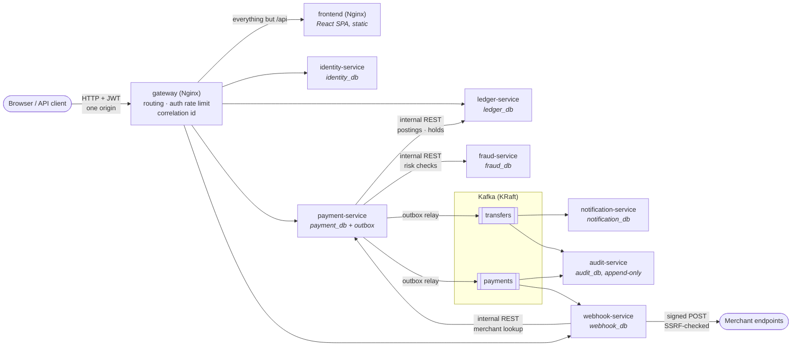
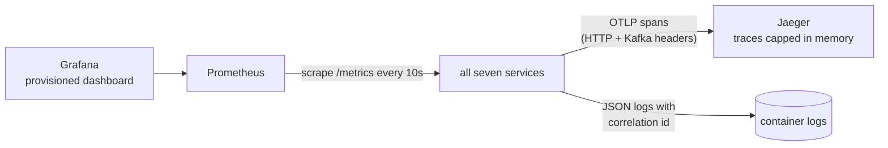
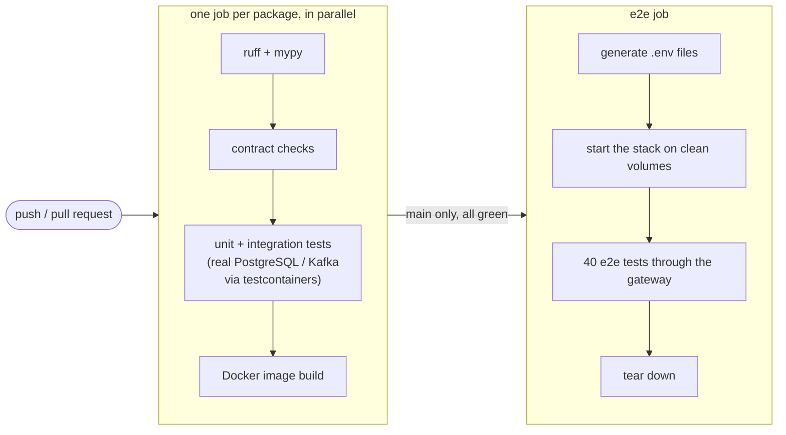

# Architecture — As Built

What actually runs today: every service, database, topic and observability
component, and how they connect. Spec Section 3.3 shows the original
target design; the differences (integrations not built yet, Redis not
introduced) are listed in [context-map.md](../context-map.md).

Related: [transfer-saga.md](transfer-saga.md),
[payment-saga.md](payment-saga.md), [event-flow.md](event-flow.md).

## Services, data and communication

Arrows between services are synchronous calls; everything through Kafka
is asynchronous. Each service owns exactly one PostgreSQL database with its
own least-privilege role (shown inside the node). Every service with a
public API verifies JWTs locally against identity-service's published,
cached JWKS — no per-request call to identity-service. `/internal/*` routes exist only on the container
network — the gateway answers `404` for them. The browser app is static
files behind the same gateway, so it calls the API on its own origin
([ADR-0006](../adr/0006-browser-auth-storage.md)); each service serves
its own `/api/v1/admin/*` routes next to the data it owns. Only payment-service owns
money-moving *intent*; only ledger-service moves money.

## Observability

## Runtime topology (`docker compose`)

`docker compose up -d --build --wait` after `./scripts/generate-dev-env.sh`
brings up the whole system (spec Section 25). Host ports:

| Component | Port | Notes |
|---|---|---|
| gateway | 8180 | the only public entry point: the web app and `/api/v1/*` |
| frontend | — | not published; reached only through the gateway |
| identity-service | 8091 | direct access for development only |
| ledger-service | 8092 | `/internal/*` reachable here, never via 8180 |
| payment-service | 8093 | |
| notification-service | 8094 | no public API |
| fraud-service | 8095 | internal only |
| webhook-service | 8097 | public API is also routed via the gateway |
| audit-service | 8098 | no public API; internal query + replay |
| PostgreSQL | 5440 | per-service roles created by `infra/postgres/init/` |
| Kafka | 9094 | external listener; services use `kafka:9092` |
| Jaeger UI | 16686 | OTLP receiver on 4318 |
| Prometheus | 9090 | |
| Grafana | 3000 | dev-only `admin`/`admin` |

Each service runs its migrations on startup and a single uvicorn
process. Background work — outbox relay, recovery and expiration workers,
reconciliation, Kafka consumers, webhook delivery — runs inside that same
process, which is why services stay single-instance for now (README,
"Load testing": the known throughput limit and the path past it).

## CI/CD pipeline

A pull request can't pass with a failing lint, type check, contract,
test or image build in any package (spec Section 26). The load test
(`tests/load`) is run by hand: its latency thresholds only mean something
on known hardware.
