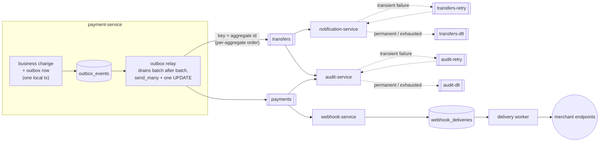
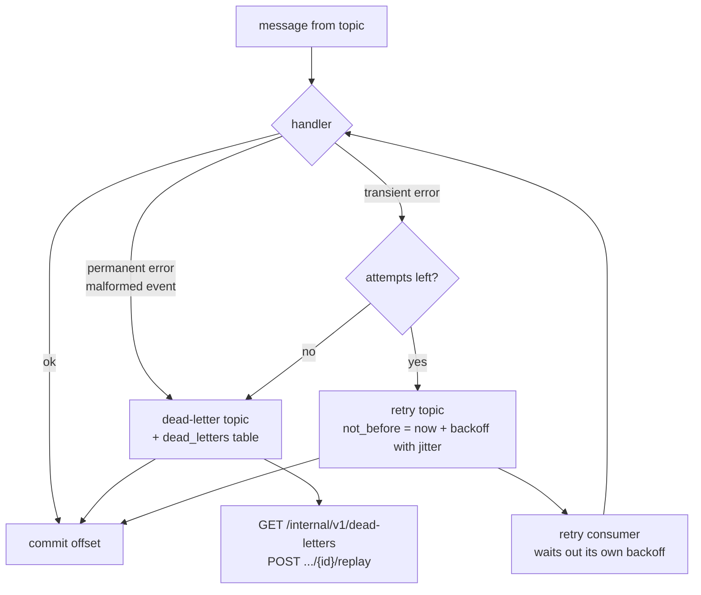
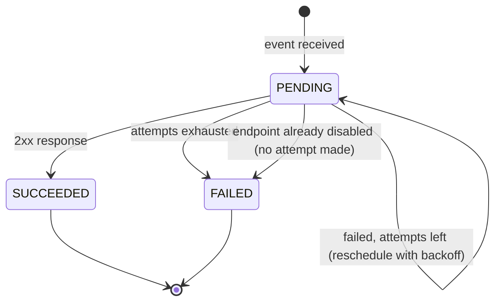

# Event Flow — Outbox, Kafka, Consumers

Spec Sections 14–18, as implemented. payment-service is the only producer
today; see [context-map.md](../context-map.md) for the events that are
designed but not yet published.

## From a committed change to every consumer

**Guarantees**

* **No lost events.** The outbox row is written in the same local
  transaction as the business change (spec 14.1): if the change
  committed, its event exists. The relay marks a batch published only
  after every message in it is acknowledged; a crash or failed send
  republishes the whole batch.
* **At-least-once, deduplicated downstream.** An outbox row's id is its
  `event_id` on every attempt, and every consumer is idempotent on it:
  `notifications.event_id`, `audit_logs.event_id` and
  `webhook_deliveries(endpoint_id, event_id)` are all `UNIQUE`, and the
  constraint — not a pre-check — decides a race.
* **Per-aggregate ordering.** Messages are keyed by aggregate id, so every
  event for one transfer or payment lands on one partition, in order.
* **One trace across the async hop.** W3C trace context rides in Kafka
  headers, so the consumer's span is a child of the producer's.

## Consumer failure handling

Used by notification-service and audit-service. A failing message is
*routed*, never retried in place, so one poison message can't block its
partition (spec Section 16). Dead letters are kept both on the DLT topic
(for an alerting consumer) and in a queryable table (for manual replay
back onto the original topic).

## Webhook delivery

webhook-service doesn't retry through Kafka at all: its consumer only
records that a delivery is owed — one `webhook_deliveries` row per active
endpoint of the payment's merchant — and commits. A separate worker owns
delivery, on its own schedule:

A delivery that exhausts its attempts adds one to its endpoint's
consecutive-failure count, and the endpoint is auto-disabled at
`DISABLE_ENDPOINT_AFTER_CONSECUTIVE_FAILURES`; any success resets the
count. A retry within one delivery's own backoff doesn't count — only a
delivery that gave up entirely. A disabled endpoint stays disabled until
its owner re-enables it.

Each attempt is signed (`X-Webhook-Signature: t=<ts>,v1=<HMAC-SHA256 of
"ts.body">`, plus `X-Webhook-Id` for the receiver's own deduplication),
re-checks the target against SSRF rules immediately before connecting
(DNS can change after registration), and is recorded with its status code
and latency.

## Observability of the pipeline

| Metric | Where | Question it answers |
|---|---|---|
| `fincore_outbox_backlog` | payment-service, per relayed batch | Is the relay keeping up with writes? |
| `fincore_kafka_consumer_lag{group,topic,partition}` | every consumer | Is a consumer keeping up with its topic? |
| `fincore_dlt_messages_total` | notification, audit | Are events being given up on? |
| `fincore_deliveries_terminally_failed_total` | webhook-service | Are merchants' endpoints failing for good? |
