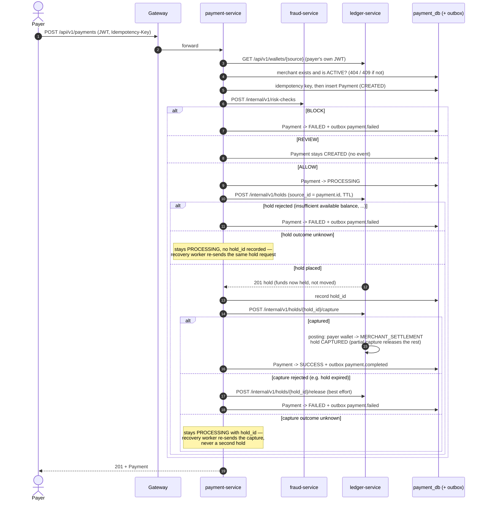
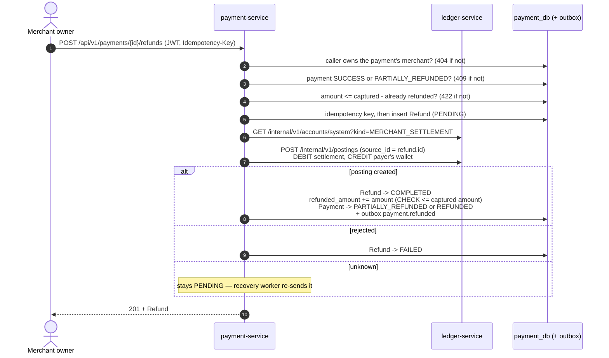

# Payment and Refund Sagas — Sequence Diagrams

Spec Section 11, orchestrated by `payment-service` — drawn from the
implementation (`services/payment-service/app/services/payments.py`,
`refunds.py`, `expiration.py`, `recovery.py`). A payment differs from a
transfer ([transfer-saga.md](transfer-saga.md)) in that money is first
**reserved** as a hold on the payer's wallet and then **captured** into
the currency's pooled `MERCHANT_SETTLEMENT` account (ADR-0002).

## Payment: fraud check -> hold -> capture

Every status change above is an atomic `UPDATE ... WHERE status =
:expected`, and only the caller whose update applies writes the outbox
event — so the saga's own call and the recovery worker can race on the
same payment without emitting an event twice.

## Refund: a new posting, never an edit

The over-refund check before the posting is only the fast path. Two
concurrent refunds that are each valid alone but together exceed the
captured amount are stopped by the database: the
`ck_payments_refunded_amount_within_bounds` CHECK constraint rejects
whichever increment loses the race.

## Background workers

| Worker | Finds | Does |
|---|---|---|
| Recovery | Payments `PROCESSING`, refunds `PENDING`, transfers `PROCESSING`, older than the stuck threshold | Re-sends exactly the step that didn't confirm (hold, capture, or refund posting) — all idempotent on `source_id` |
| Expiration | Payments still `CREATED` past `PAYMENT_REVIEW_TTL_SECONDS` (a `REVIEW` nobody resolved) | `CREATED -> EXPIRED` + `payment.failed`. No hold exists yet at `CREATED`, so there is nothing to release |
| Outbox relay | Unpublished outbox rows | Publishes them to the `payments` / `transfers` topics — see [event-flow.md](event-flow.md) |

A hold that is never captured is expired lazily on ledger-service's side
after its TTL, releasing the funds even if payment-service never comes
back to it.
