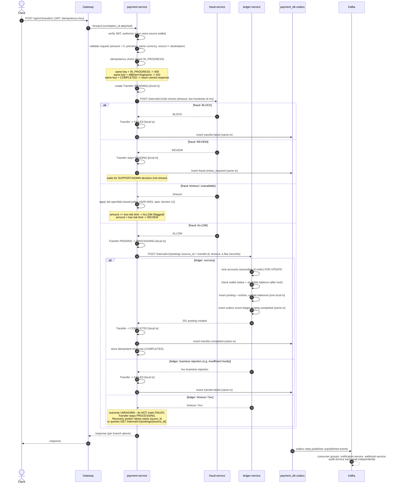

# Transfer Saga — Sequence Diagram

This diagram is the visual form of Section 10.1 of [spec.md](../spec.md),
orchestrated by `payment-service`. It shows the happy path plus every
failure branch the saga must handle: fraud `BLOCK`, fraud `REVIEW`, and the
ledger call timing out (unknown outcome).

See [ADR-0003](../adr/0003-sync-vs-async-communication.md) for why the
`ledger-service` and `fraud-service` calls are synchronous, and
[ADR-0002](../adr/0002-ledger-model.md) for what a "posting" is.

## Happy path + failure branches

## Why each failure branch behaves the way it does

| Branch | Terminal state? | Reasoning |
|---|---|---|
| Fraud `BLOCK` | Yes — `FAILED` | A block is a definitive business decision, safe to finalize immediately. |
| Fraud `REVIEW` | No — stays `PENDING` | A human must decide; the saga cannot guess, so it parks rather than fails or succeeds. |
| Fraud unavailable/timeout | Depends on policy | The failure policy (ADR-0003 / spec Section 12) substitutes for the missing decision — never a bare retry loop, since a slow fraud-service should not stall every transfer. |
| Ledger business rejection (e.g. insufficient funds) | Yes — `FAILED` | The ledger gave a definitive, synchronous answer; no ambiguity about what happened. |
| Ledger timeout / 5xx | **No — never `FAILED`** | Money may or may not have actually moved; declaring `FAILED` here could cause a user to be told "it failed" while their balance already changed. The transfer stays `PROCESSING` until the recovery worker resolves it, using the *same* `source_id` so any retried posting call is idempotent. |

## Recovery path (not shown above)

When a ledger call times out, a background **recovery worker** (built in
Phase 3) periodically:

1. Finds transfers stuck in `PROCESSING` past a threshold.
2. Retries `POST /internal/v1/postings` with the same `source_id` — safe,
   because `ledger-service` enforces `UNIQUE (source_service, source_id,
   type)` and returns the existing posting if one already exists rather
   than creating a duplicate.
3. If a posting is found (either from the retry or from
   `GET /internal/v1/postings/{source_id}`), the transfer is moved to its
   correct terminal state based on that posting's outcome.

The same reconciliation job described in ADR-0002 independently verifies
no transfer is stuck in `PROCESSING` indefinitely, as a second safety net
on top of the recovery worker.
