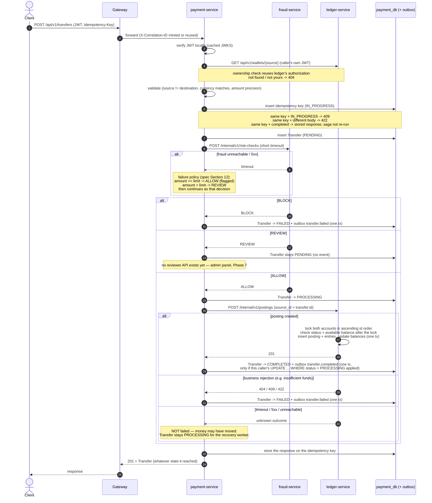

# Transfer Saga — Sequence Diagram

The visual form of Section 10.1 of [spec.md](../spec.md), orchestrated by
`payment-service` — drawn from the implementation
(`services/payment-service/app/api/v1/transfers.py`,
`app/services/transfers.py`), not from the original design. It shows the
happy path plus every failure branch: fraud `BLOCK`, fraud `REVIEW`, fraud
unreachable, a ledger business rejection, and the ledger call ending with
an unknown outcome.

See [ADR-0003](../adr/0003-sync-vs-async-communication.md) for why the
`ledger-service` and `fraud-service` calls are synchronous,
[ADR-0002](../adr/0002-ledger-model.md) for what a "posting" is, and
[payment-saga.md](payment-saga.md) for the hold/capture variant.

## Happy path + failure branches

```mermaid
sequenceDiagram
    autonumber
    actor Client
    participant GW as Gateway
    participant PAY as payment-service
    participant FRAUD as fraud-service
    participant LEDGER as ledger-service
    participant DB as payment_db (+ outbox)

    Client->>GW: POST /api/v1/transfers (JWT, Idempotency-Key)
    GW->>PAY: forward (X-Correlation-ID minted or reused)

    PAY->>PAY: verify JWT locally (cached JWKS)
    PAY->>LEDGER: GET /api/v1/wallets/{source} (caller's own JWT)
    Note over PAY,LEDGER: ownership check reuses ledger's authorization<br/>not found / not yours -> 404
    PAY->>PAY: validate (source != destination, currency matches, amount precision)

    PAY->>DB: insert idempotency key (IN_PROGRESS)
    Note over PAY,DB: same key + IN_PROGRESS -> 409<br/>same key + different body -> 422<br/>same key + completed -> stored response, saga not re-run

    PAY->>DB: insert Transfer (PENDING)
    PAY->>FRAUD: POST /internal/v1/risk-checks (short timeout)

    alt fraud unreachable / 5xx
        FRAUD--xPAY: timeout
        Note over PAY: failure policy (spec Section 12):<br/>amount <= limit -> ALLOW (flagged)<br/>amount > limit -> REVIEW<br/>then continues as that decision
    end

    alt BLOCK
        FRAUD-->>PAY: BLOCK
        PAY->>DB: Transfer -> FAILED + outbox transfer.failed (one tx)
    else REVIEW
        FRAUD-->>PAY: REVIEW
        PAY->>DB: Transfer stays PENDING (no event)
        Note over PAY: no reviewer API exists yet — admin panel, Phase 7
    else ALLOW
        FRAUD-->>PAY: ALLOW
        PAY->>DB: Transfer -> PROCESSING
        PAY->>LEDGER: POST /internal/v1/postings (source_id = transfer.id)

        alt posting created
            LEDGER->>LEDGER: lock both accounts in ascending id order<br/>check status + available balance after the lock<br/>insert posting + entries, update balances (one tx)
            LEDGER-->>PAY: 201
            PAY->>DB: Transfer -> COMPLETED + outbox transfer.completed (one tx,<br/>only if this caller's UPDATE ... WHERE status = PROCESSING applied)
        else business rejection (e.g. insufficient funds)
            LEDGER-->>PAY: 404 / 409 / 422
            PAY->>DB: Transfer -> FAILED + outbox transfer.failed (one tx)
        else timeout / 5xx / unreachable
            LEDGER--xPAY: unknown outcome
            Note over PAY: NOT failed — money may have moved.<br/>Transfer stays PROCESSING for the recovery worker.
        end
    end

    PAY->>DB: store the response on the idempotency key
    PAY-->>GW: 201 + Transfer (whatever state it reached)
    GW-->>Client: response
```

The outbox rows are published asynchronously afterwards — see
[event-flow.md](event-flow.md).

## Why each branch behaves the way it does

| Branch | Terminal state? | Reasoning |
|---|---|---|
| Fraud `BLOCK` | Yes — `FAILED` | A block is a definitive business decision, safe to finalize immediately. The ledger is never called. |
| Fraud `REVIEW` | No — stays `PENDING` | A human must decide; the saga can't guess, so it parks rather than fails or succeeds. Nothing is published. |
| Fraud unavailable | Depends on policy | The failure policy (ADR-0003 / spec Section 12) substitutes for the missing decision, so a slow fraud-service can't stall every transfer — and can't auto-approve a large one either. |
| Ledger business rejection | Yes — `FAILED` | The ledger gave a definitive, synchronous answer; no ambiguity about what happened. |
| Ledger timeout / 5xx | **No — never `FAILED`** | Money may or may not have moved. Reporting "failed" while the balance already changed would be worse than an operation left open. |

## Recovery path

A background **recovery worker** in payment-service, every
`RECOVERY_WORKER_INTERVAL_SECONDS`:

1. Finds transfers left in `PROCESSING` longer than
   `RECOVERY_WORKER_STUCK_AFTER_SECONDS` (a request still genuinely in
   flight is left alone rather than raced).
2. Re-sends the **same** `POST /internal/v1/postings` with the same
   `source_id`. That's safe: ledger-service enforces
   `UNIQUE (source_service, source_id, type)` and returns the existing
   posting if the first attempt did land, instead of moving money twice.
3. Resolves the transfer exactly as the original saga would have. If the
   saga's own call and the recovery worker race to resolve the same
   transfer, only the one whose `UPDATE ... WHERE status = 'PROCESSING'`
   applies writes the outbox event.

How many operations were found stuck on the last pass is exported as
`fincore_stuck_processing{operation_type}`. Separately, ledger-service's
reconciliation job verifies the ledger's own invariants (balanced
postings, balances matching entries, no negative wallet, one posting per
source) — it can't see `payment_db`, so stuck *transfers* are the
recovery worker's and that gauge's concern, not reconciliation's.
